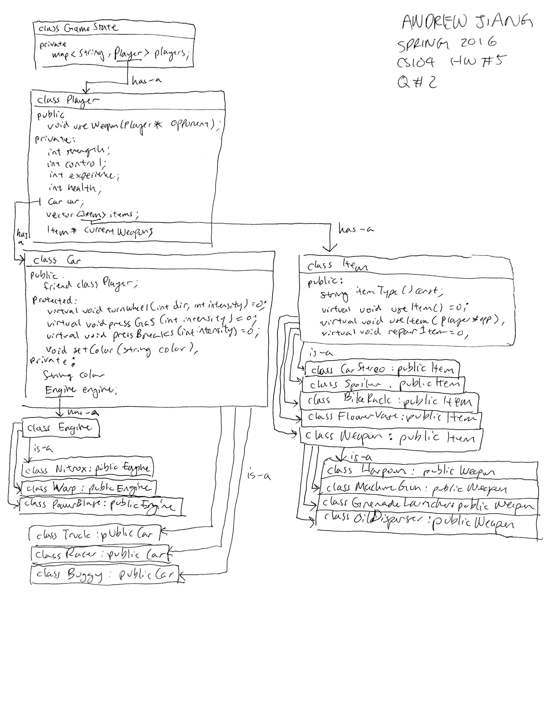

# CS 104 HW5

## Question 1

## To run Facile Debugger:
* run `qmake`
* run `make`
* create an `input.in` file with Facile progrram.
* run `./debugger`
* enter filename when prompted

## To use Facile Debugger:
* The debugger highlights a line of program RED indicating that that line **will** execute when you hit `step`, `next`, or `continue`. 
* If the program reaches the END statement, it will highlight that line GREEN and halt there, even if you continue to press `step`.
* In order to reset the program, hit the `reset` button. (Note: it is easy to implement this functionality as something that occurs immediately after the program ends, however I disagree with that UX. As a programmer I want to see a concrete area where the program ends, especially if it ended at RETURN. I also want to know where an error may halt a program from comtinuing, which is also obvious in my debugger. Also I want to be able to reset the program at any given moment.
* When clicking `inspect` it will automatically update the values window. Every time you run more lines on the program, either hit `inspect` or `update` in order to update the values window again.
* `Toggle Break` adds a breakpoint at highlighted line, but if the line is already a breakpoint this function will remove the breakpoint.
* `Unload` will reopen the Load dialogue for you to easily select a new program without exiting the application.

All other functions should behave as expected without segfaulting. All errors will be thrown onto an Error dialogue.
