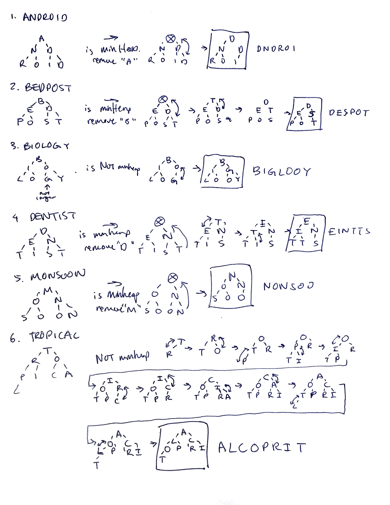

# CS 104 HW6

## To run maze
* run `qmake`
* run `make`
* run `./maze
* generate maze
* select algorithm to solve maze. Options include:
	* Breadth-first search
	* Depth-first search (recursive)
	* Depth-first search (iterative)
	* A-star with no heuristic
	* A-star with heuristic calculated by manhattan distance (rows + cols)
	* A-star with heuristic calculated by euclidian distance (sqrt(rows^2 + cols^2))

## Question 2
